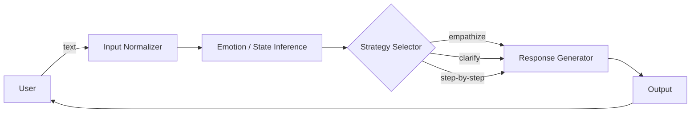

# COMPSYS 731 Human-Robot Interaction

[](https://www.auckland.ac.nz/)
[](#)

面向教育场景的情绪感知聊天机器人：在对话中识别学习者情绪与状态，并以更符合情境的方式回应（安抚、鼓励、引导与提示），提升交互体验与学习支持效果。

<p align="center">
  
</p>

## Emotion-Aware Academic Assistant for Paper Reading Support

## 目录

- [项目亮点](#项目亮点)
- [Demo](#demo)
- [快速开始](#快速开始)
- [使用方式](#使用方式)
- [项目结构](#项目结构)
- [系统设计](#系统设计)
- [评估方式](#评估方式)
- [路线图](#路线图)
- [贡献者](#贡献者)
- [致谢](#致谢)

## 项目亮点

- 情绪识别：从文本与对话上下文推断情绪/压力/困惑等维度（可替换模型与规则）
- 情绪策略：根据识别结果选择应对策略（共情、澄清、分步指导、鼓励）
- 教育场景：面向问答、作业辅导、概念讲解等交互任务
- 可解释性：提供“为什么这样回应”的简要依据（可选）

## Demo

<p align="center">
  
</p>

| 场景                | 示例                                        |
| ------------------- | ------------------------------------------- |
| 困惑（confused）    | 引导复述问题 → 给出最小可行提示 → 分步讲解  |
| 挫败（frustrated）  | 共情 + 鼓励 → 降低任务难度 → 给出下一步行动 |
| 高自信（confident） | 提供扩展阅读/挑战题 → 强化学习迁移          |

## 快速开始

1. 克隆仓库
2. 安装依赖
3. 配置运行参数
4. 启动服务或运行脚本

将下方命令替换为你们项目的实际方式：

```bash
# 示例：Python
python -m venv .venv
source .venv/bin/activate
pip install -r requirements.txt
python app.py
```

```bash
# 示例：Node.js
npm install
npm run dev
```

## 使用方式

### 输入输出约定

- 输入：用户文本（可选：对话历史、课程上下文、题目/讲义片段）
- 输出：机器人回复（可选：情绪标签、策略类型、置信度、解释）

### 交互示例

```text
User: 我完全看不懂这个题目要我做什么……
Bot: 我懂，这种感觉很挫败。我们先一起把题目拆成两步：1) 题目问的目标是什么；2) 已知条件有哪些。你把题干贴出来，我先帮你标出关键信息。
```

## 项目结构

用自己的目录替换：

```text
.
├── src/                  # 核心代码
├── data/                 # 数据与样例
├── models/               # 情绪识别/对话模型
├── prompts/              # 提示词模板（如使用LLM）
├── tests/                # 测试
└── README.md
```

## 系统设计

### 端到端流程



### 关键模块说明

- Emotion / State Inference：情绪标签、强度与学习状态（困惑/挫败/无聊/自信等）
- Strategy Selector：把情绪/任务类型映射到策略（共情、澄清、提示、分解、鼓励）
- Response Generator：生成最终回复（可基于模板、检索增强或对话模型）

### 截图与对比

| 情绪感知关闭                                                 | 情绪感知开启                                               |
| ------------------------------------------------------------ | ---------------------------------------------------------- |
|  |  |

## 评估方式

- 任务指标：问题解决率、平均轮次、完成时间、错误率
- 主观量表：满意度、感知同理心、学习自我效能
- 消融实验：无情绪识别 / 无策略选择 / 不同提示模板

## 路线图

- [ ] 设计情绪标签与策略映射表
- [ ] 增加可视化：对话中实时展示情绪与策略
- [ ] 构建评估脚本与问卷模板

## 贡献者

- Team 15

## 致谢

- COMPSYS 731 课程与助教团队
