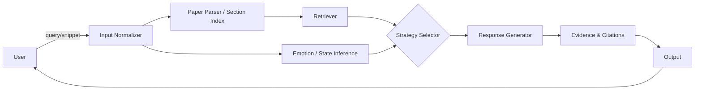

# Emotion-Aware Academic Assistant for Paper Reading Support

[](https://www.auckland.ac.nz/)
[](#)

An emotion-aware assistant that supports academic paper reading. It detects learners’ emotions and reading states during dialogue and adapts responses accordingly (empathize, encourage, clarify, scaffold), improving comprehension, engagement, and study outcomes.

<p align="center">
  
</p>

## Table of Contents

- [Highlights](#highlights)
- [Demo](#demo)
- [Quick Start](#quick-start)
- [Usage](#usage)
- [Project Structure](#project-structure)
- [System Design](#system-design)
- [Evaluation](#evaluation)
- [Roadmap](#roadmap)
- [Contributors](#contributors)
- [Acknowledgements](#acknowledgements)

## Highlights

- Emotion/State inference from dialogue and reading context (confusion, frustration, confidence, curiosity).
- Strategy selection that adapts explanations: empathize, clarify, step-by-step scaffolding, challenge/extend.
- Paper-centric capabilities: section-aware Q&A, concept linking, figures/tables callouts, citation-aware references.
- Optional explainability: brief rationale for the chosen strategy or extracted evidence snippets.
- Modular design: swappable emotion models, retrieval pipelines, and response templates.

## Demo

<p align="center">
  
</p>

| Scenario          | Example                                                                           |
| ----------------- | --------------------------------------------------------------------------------- |
| Confused          | Ask for restatement → smallest useful hint → step-by-step walkthrough             |
| Frustrated        | Empathize + encouragement → reduce task complexity → propose concrete next step   |
| Confident/Curious | Suggest deeper reading, related work, or small challenges to extend understanding |

## Quick Start

This repository currently acts as a scaffold for the project. Replace the commands below with your actual setup when code is added.

Typical examples:

```bash
# Python example
python -m venv .venv
source .venv/bin/activate
pip install -r requirements.txt
python app.py
```

```bash
# Node.js example
npm install
npm run dev
```

## Usage

### Inputs and Outputs

- Input: user query about a paper; optional chat history; optional paper/PDF snippet, section, or figure/table.
- Output: assistant reply; optional emotion label, selected strategy, confidence, and short rationale or evidence snippet.

### Interaction Examples

```text
User: I’m lost in the method section—what is the core idea behind the loss function?
Assistant: That can be frustrating. Let’s unpack it in two steps: (1) what the model optimizes; (2) how the loss aligns with the objective. If you paste the loss formula or paragraph, I’ll highlight its components and link them to the model’s outputs.
```

```text
User: This paragraph is dense. Can you summarize the contribution and give me a one-sentence takeaway?
Assistant: The authors propose a retrieval-augmented approach that improves sample efficiency on low-resource tasks. Takeaway: by injecting domain evidence at training and inference, they reduce hallucinations and improve generalization.
```

## Project Structure

Replace with your own layout when code is added:

```text
.
├── src/                  # core logic
├── data/                 # datasets and samples
├── models/               # emotion inference / dialogue components
├── prompts/              # prompt templates (if using LLMs)
├── tests/                # tests
└── README.md
```

## System Design

### End-to-End Flow



### Key Modules

- Paper Parser / Section Index: extract sections, figures/tables, equations, and build a section-aware index.
- Emotion / State Inference: infer learner states such as confusion, frustration, boredom, confidence.
- Strategy Selector: map emotion and task type to response strategies (empathize, clarify, hint, decompose, encourage, extend).
- Response Generator: produce final replies using templates, retrieval-augmented generation, or dialogue models.
- Evidence & Citations: surface cited sentences, figures, or sections to ground the response.

### Screenshots and Contrast

| Emotion Awareness Off                                        | Emotion Awareness On                                       |
| ------------------------------------------------------------ | ---------------------------------------------------------- |
|  |  |

## Evaluation

- Task metrics: comprehension question success rate, average turns, time-to-answer, error rate.
- User-reported: satisfaction, perceived empathy, reading self-efficacy.
- Ablations: no emotion inference vs no strategy selection vs template variants.

## Roadmap

- [ ] Define emotion labels and strategy mapping table tailored for paper reading.
- [ ] Add visualization of emotion and strategy during dialogue.
- [ ] Build evaluation scripts and survey templates for reading support.
- [ ] Implement section-aware retrieval over PDFs with citation extraction.
- [ ] Support figure/table-aware Q&A and math-aware explanations.

## Contributors

- Team 15

## Acknowledgements

- COMPSYS 731 course and teaching team
